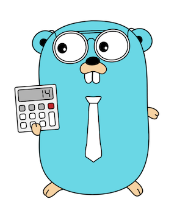

# Sudoku Çözücü - Go (Golang)



Resmen ruh çözücü gibi oldu başlığı. Bu yüzden bu tarz şeylere Türkçe isimler vermeyi garip buluyorum 😅

Neyse, her şey @Protein_Team'in mini hackaton'u ile başladı... Ne kadar da güzel hikayeleştirmek 🙂

Neyse, kodlar kendini anlatıyor.

Kullanılan algoritma backtracking algoritması. Şuradan detaylı bilgiye ulaşmak mümkün https://en.wikipedia.org/wiki/Backtracking#Examples

Hızlı bir şekilde (eğer bilgisayarınızda go yüklü ise) aşağıdaki komutu çağırarak doğrudan çalıştırabilirsiniz.

```sh
go get -u github.com/se/sudoku-solver
```

Sonrasında tek yapmanız gereken terminalinizde aşağıdaki komutu yazmak;

```sh
sudoku-solver
```

https://github.com/dimitri/sudoku/blob/master/sudoku.txt adresinden örnek sudoku textlerine ulaşabilirsiniz.

Tek yapmanız gereken build ettikten sonra tek satır halinde kodları vermek.

Örneğin;

```sh
go build
./sudoku-solver 003020600900305001001806400008102900700000008006708200002609500800203009005010300
```
veya go get ile yüklediyseniz;

```sh
sudoku-solver 003020600900305001001806400008102900700000008006708200002609500800203009005010300
```

Çıktı da şu şekilde;

```log
003020600900305001001806400008102900700000008006708200002609500800203009005010300
Board Size: 9
———————————| BOARD |———————————
| ·  ·  3 | ·  2  · | 6  ·  · |
| 9  ·  · | 3  ·  5 | ·  ·  1 |
| ·  ·  1 | 8  ·  6 | 4  ·  · |
———————————————————————————————
| ·  ·  8 | 1  ·  2 | 9  ·  · |
| 7  ·  · | ·  ·  · | ·  ·  8 |
| ·  ·  6 | 7  ·  8 | 2  ·  · |
———————————————————————————————
| ·  ·  2 | 6  ·  9 | 5  ·  · |
| 8  ·  · | 2  ·  3 | ·  ·  9 |
| ·  ·  5 | ·  1  · | 3  ·  · |
———————————————————————————————

Board is solved 😄
———————————| BOARD |———————————
| 4  8  3 | 9  2  1 | 6  5  7 |
| 9  6  7 | 3  4  5 | 8  2  1 |
| 2  5  1 | 8  7  6 | 4  9  3 |
———————————————————————————————
| 5  4  8 | 1  3  2 | 9  7  6 |
| 7  2  9 | 5  6  4 | 1  3  8 |
| 1  3  6 | 7  9  8 | 2  4  5 |
———————————————————————————————
| 3  7  2 | 6  8  9 | 5  1  4 |
| 8  1  4 | 2  5  3 | 7  6  9 |
| 6  9  5 | 4  1  7 | 3  8  2 |
———————————————————————————————
Toke 0.008635821 secs to solve.
```

Bir şey vermeseniz dahi kendi içerisinde bulunna bir örneğin doğrudan çözümünü size verecek.

Onu da şu şekilde yazıyoruz;

```
go build
./sudoku-solver
```

Build etmeden direk çalıştırmak istiyorsanız;

```
go run main.go
```